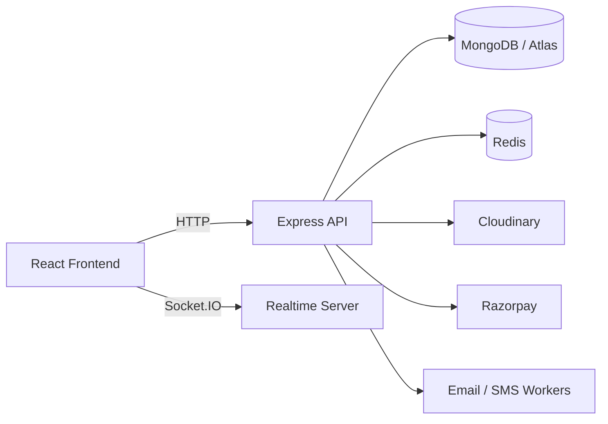

# Event Manager

Event Manager is a full-stack event, movie-show, and ticketing platform built with React, Node.js, Express, MongoDB, Redis, and Socket.IO. The project now includes a working admin console for managing movie catalogs, creating show schedules, handling posters, and rolling shows out across multiple cities.

## What is included now

- Customer-facing event and movie-show discovery
- Authentication, profile management, password reset, and OTP flow
- Ticket booking, seat holding, and reservation handling
- Admin dashboard for analytics, user oversight, and catalog management
- Movie/show creation with:
  - show start date and time
  - optional availability end date
  - multi-city selection by clicking cities
  - poster upload or URL input
- Docker-based local deployment with frontend, backend, MongoDB, Redis, and Nginx
- MongoDB Atlas support through the backend environment configuration

## Architecture



## Tech stack

- Frontend: React 19, Vite, React Router, Tailwind CSS, Axios, Socket.IO Client
- Backend: Node.js, Express.js, Mongoose, Socket.IO, BullMQ
- Data: MongoDB, Redis
- Integrations: Razorpay, Cloudinary, Nodemailer, QR code generation, CSV export

## Repository layout

```text
.
|-- backend/
|   |-- src/
|   |-- scripts/
|   |-- uploads/
|   |-- package.json
|   `-- .env
|-- frontend/
|   |-- src/
|   |-- public/
|   |-- package.json
|-- docker-compose.yml
|-- nginx.conf
|-- DEPLOYMENT.md
`-- README.md
```

## Quick start with Docker

This is the recommended way to run the project locally.

1. Make sure the backend environment file exists at [backend/.env](backend/.env).
2. Ensure the MongoDB connection string is set in that file.
3. From the project root, run:

```bash
docker compose up -d --build
```

4. Open the app at:
   - Frontend: http://localhost:5173
   - Backend API: http://localhost:5051

### Useful Docker commands

```bash
docker compose down
docker compose logs -f backend
docker compose logs -f frontend
```

## Create an admin user

A helper script is available to create or update an admin account:

```bash
cd backend
node scripts/createAdmin.js "Admin Name" admin@example.com your-password --verify
```

## Local development (without Docker)

### Prerequisites

- Node.js 20+
- MongoDB or MongoDB Atlas access
- Redis (recommended for workers and ticket flows)

### Install dependencies

```bash
cd backend
npm install

cd ../frontend
npm install
```

### Backend environment

Set the required values in [backend/.env](backend/.env), including:

```env
NODE_ENV=development
PORT=5050
MONGO_URI=your_mongodb_connection_string
JWT_SECRET=your_long_random_secret
CLIENT_URL=http://localhost:5173
REDIS_HOST=127.0.0.1
REDIS_PORT=6380
REDIS_URL=redis://127.0.0.1:6380/0
```

### Run locally

```bash
cd backend
npm run dev
```

In a second terminal:

```bash
cd frontend
npm run dev
```

## Available scripts

### Backend

- `npm run dev` - start the API with nodemon
- `npm start` - run the production server
- `npm run seed` - seed the database
- `npm run bulk-index` - bulk index search data
- `npm run test:webhook` - test Razorpay webhook handling

### Frontend

- `npm run dev` - run the Vite development server
- `npm run build` - create a production build
- `npm run lint` - run ESLint
- `npm run preview` - preview the production build

## Admin capabilities

The admin area now supports:

- reviewing platform analytics and pending approvals
- managing movies and shows from one dashboard
- selecting multiple cities for a show rollout
- setting an availability end date for a show
- uploading posters or using a poster URL

## API highlights

Main backend routes include:

- `GET /api/health`
- `GET /api/auth/me`
- `POST /api/auth/signup`
- `POST /api/auth/login`
- `POST /api/auth/forgot-password`
- `POST /api/auth/reset-password`
- `GET /api/events`
- `GET /api/tickets`
- `GET /api/admin`
- `GET /api/stats`

## Deployment

The project is prepared for container-based deployment and split frontend/backend hosting.

- Backend: Node.js service with MongoDB and Redis
- Frontend: Vite build served through Nginx
- Full setup notes: [DEPLOYMENT.md](DEPLOYMENT.md)

## License

MIT

## Author

Ansh Rastogi
