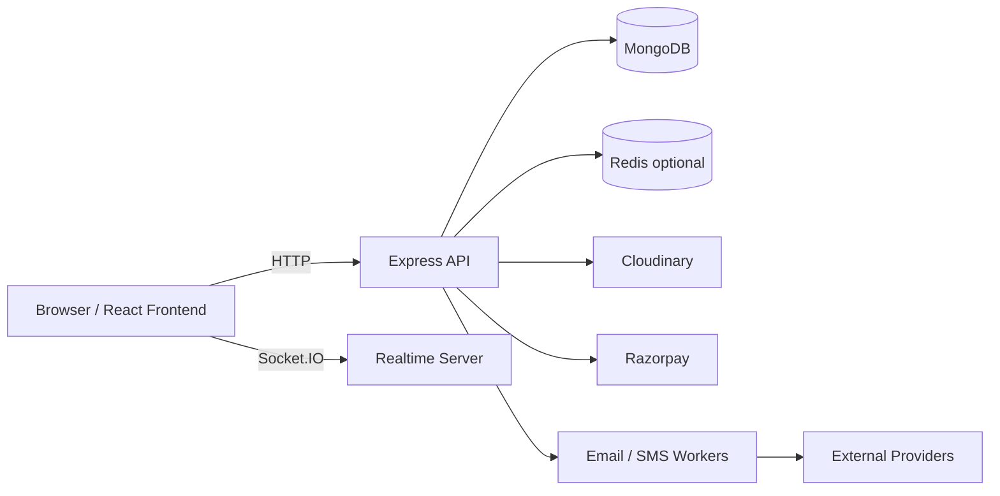

# Event Manager

Real-time event discovery, booking, ticketing, and administration platform built with React, Node.js, Express, MongoDB, and Socket.IO.

This project is designed to feel production-ready: it includes role-based dashboards, secure authentication, live updates, background workers, payment handling, and a deployment model that cleanly splits frontend and backend.

## Why This Project Stands Out

- End-to-end product flow: browse events, sign up, book, pay, receive tickets, and manage registrations.
- Real-time experience: Socket.IO powers live announcements and updates.
- Production-minded backend: security middleware, rate limiting, cookies, compression, and structured route separation.
- Multi-role system: customer, organizer, and admin experiences are separated through protected routes and authorization.
- Operational features: email, SMS, refund, ticket-hold, and reminder workers run alongside the API.
- Deployment ready: frontend and backend can be deployed independently with a clear environment-variable contract.

## Core Capabilities

### Users

- Search and filter events
- View event details and movie show pages
- Register and book tickets
- Receive QR-based and PDF ticket output
- Reset passwords and verify accounts through OTP
- See personalized recommendations and live announcements

### Organizers

- Create, update, and delete events
- Upload poster/media assets
- Track registrations and attendance
- Export participant data
- Manage check-ins and event operations

### Admins

- Access admin-only dashboards
- Review platform activity and analytics
- Moderate and oversee the ecosystem end to end

## Architecture



## Tech Stack

- Frontend: React 19, Vite, React Router, Tailwind CSS, Axios, Socket.IO Client
- Backend: Node.js, Express.js, Mongoose, Socket.IO, BullMQ
- Data: MongoDB, Redis
- Integrations: Razorpay, Cloudinary, Nodemailer, QR code generation, CSV export

## Repository Layout

```text
.
|-- backend/
|   |-- src/
|   |-- scripts/
|   |-- uploads/
|   |-- package.json
|   `-- .env.example
|-- frontend/
|   |-- src/
|   |-- public/
|   |-- package.json
|   `-- .env.example
|-- DEPLOYMENT.md
`-- README.md
```

## Key Engineering Details

- Route-level protection is enforced in the frontend and backend.
- Backend middleware includes `helmet`, `cors`, `morgan`, `compression`, `cookie-parser`, and rate limiting on `/api`.
- The backend serves static uploads from `/uploads`.
- Background loops start on server boot for ticket cleanup and event reminders.
- Socket.IO is initialized from the main server entrypoint.
- Environment validation is centralized in `backend/src/config/env.js`.

## Getting Started

### Prerequisites

- Node.js 18 or newer
- MongoDB
- Optional: Redis, Razorpay, Cloudinary, and SMTP credentials

### Clone the repository

```bash
git clone <repo-url>
cd Eventmanager-main
```

### Install dependencies

```bash
cd backend
npm install

cd ../frontend
npm install
```

### Configure backend environment

Create `backend/.env` from `backend/.env.example`.

Minimum required values:

```env
NODE_ENV=development
PORT=5050
MONGO_URI=your_mongodb_connection_string
JWT_SECRET=your_long_random_secret
```

Recommended local development values:

```env
JWT_EXPIRES_IN=7d
CLIENT_URL=http://localhost:5173
CLIENT_URLS=http://localhost:5173
AUTH_OTP_EXPIRES_IN_MINUTES=5
AUTH_OTP_MAX_ATTEMPTS=5
AUTH_OTP_RESEND_COOLDOWN_SECONDS=60
PASSWORD_RESET_TOKEN_TTL_MINUTES=30
TICKET_HOLD_MINUTES=8
SMTP_HOST=
SMTP_PORT=587
SMTP_USER=
SMTP_PASS=
EMAIL_FROM=
RAZORPAY_KEY_ID=
RAZORPAY_KEY_SECRET=
RAZORPAY_WEBHOOK_SECRET=
REDIS_URL=
REDIS_HOST=localhost
REDIS_PORT=6379
REDIS_PASSWORD=
CLOUDINARY_CLOUD_NAME=
CLOUDINARY_API_KEY=
CLOUDINARY_API_SECRET=
CLOUDINARY_FOLDER=event-manager
ELASTIC_URL=
```

### Configure frontend environment

Create `frontend/.env` from `frontend/.env.example`.

```env
VITE_API_URL=http://localhost:5050
VITE_SOCKET_URL=http://localhost:5050
VITE_USE_SAME_ORIGIN=false
```

If the frontend and backend are served from the same domain, set:

```env
VITE_USE_SAME_ORIGIN=true
```

## Run Locally

Start the backend:

```bash
cd backend
npm run dev
```

Start the frontend in a separate terminal:

```bash
cd frontend
npm run dev
```

## Available Scripts

### Backend

- `npm run dev` - start the API with nodemon
- `npm start` - run the production server
- `npm run seed` - seed the database
- `npm run bulk-index` - bulk index search data
- `npm run test:webhook` - test Razorpay webhook handling

### Frontend

- `npm run dev` - run the Vite dev server
- `npm run build` - create a production build
- `npm run lint` - run ESLint
- `npm run preview` - preview the production build

## API Surface

Main routes exposed by the backend:

- `GET /api/health`
- `GET /api/location/current`
- `GET /api/auth/me`
- `POST /api/auth/signup`
- `POST /api/auth/login`
- `POST /api/auth/otp/verify`
- `POST /api/auth/otp/resend`
- `POST /api/auth/forgot-password`
- `POST /api/auth/reset-password`
- `GET /api/events`
- `GET /api/events/:id`
- `POST /api/events`
- `PUT /api/events/:id`
- `DELETE /api/events/:id`
- `GET /api/registrations`
- `GET /api/reviews`
- `GET /api/admin`
- `GET /api/stats`
- `GET /api/tickets`

Static uploads are available at `/uploads`.

## Deployment

Recommended split deployment:

- Backend: Render
- Frontend: Vercel

See [`DEPLOYMENT.md`](DEPLOYMENT.md) for the full setup guide and environment variable expectations.

## Interview Talking Points

If you are presenting this project, these are the strongest points to emphasize:

- You built both the customer-facing experience and the operational backend.
- You handled auth, authorization, and role-based routing.
- You added real-time behavior instead of a purely static CRUD app.
- You designed for reliability with background workers and ticket-hold cleanup.
- You integrated third-party services for payments, media, and notifications.
- You prepared the app for real deployment with separate frontend and backend environments.

## License

MIT license 

## Author

Ansh Rastogi 
